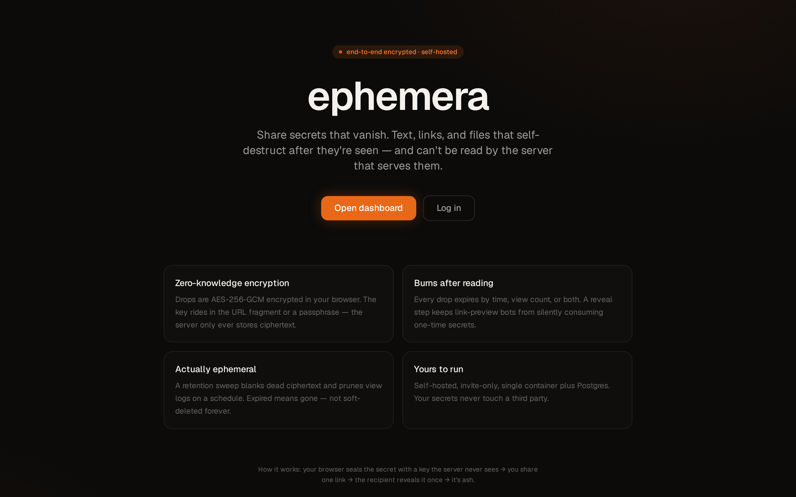
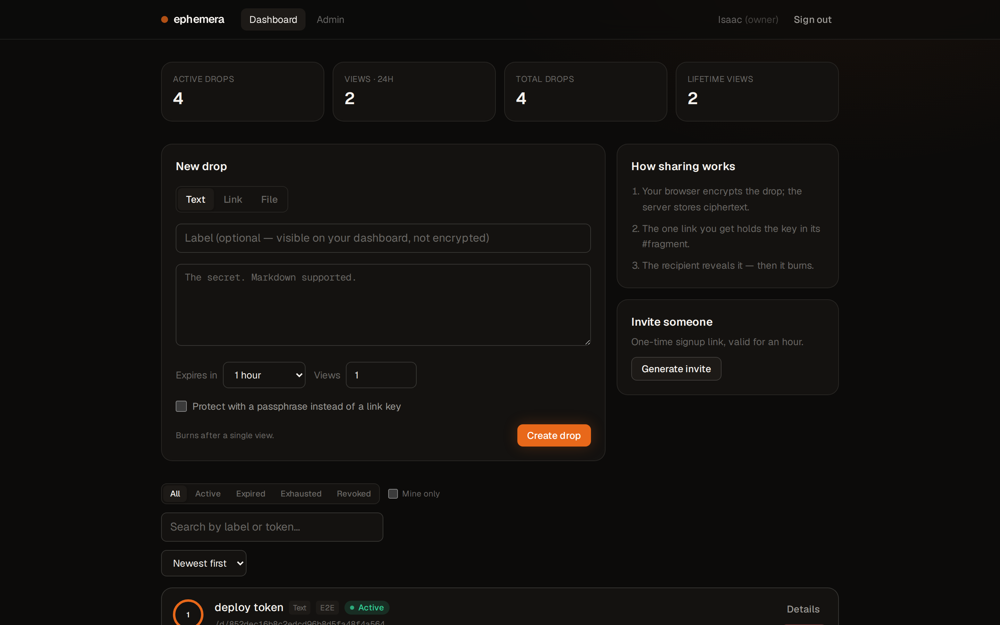
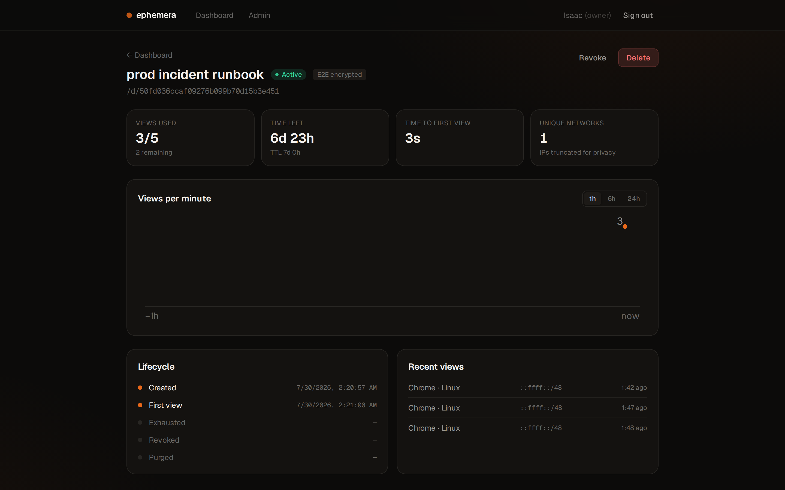
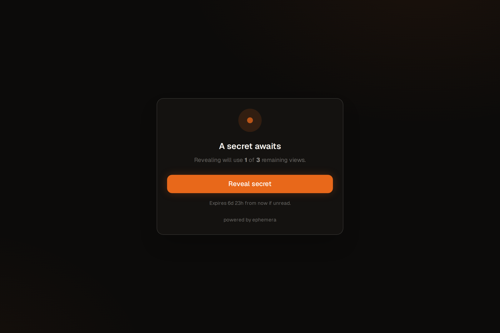
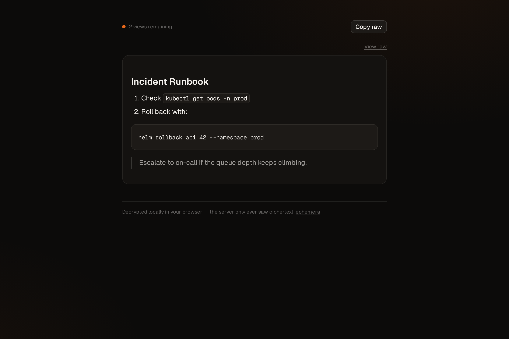

# ephemera

**Share secrets that vanish.** Self-hosted, end-to-end encrypted drops — text, links, and files that self-destruct after they're seen, and that the server literally cannot read.



## Why

Pasting a password into Slack means it lives in Slack forever. Ephemera gives you a link instead: the secret is encrypted **in your browser** before upload, the link works a fixed number of times (default: once), and a retention sweep erases the ciphertext after it dies. The server only ever stores bytes it can't decrypt.

## How the encryption works

```
creator's browser                    server                     recipient's browser
─────────────────                    ──────                     ───────────────────
secret ──AES-256-GCM──▶ ciphertext ──store──▶ ciphertext ──▶ ciphertext ──decrypt──▶ secret
            ▲                                                        ▲
       random key ───────── travels in the URL #fragment ───────────┘
                            (never sent to the server)
```

- **Link mode** — a random 256-bit key is generated client-side and carried in the URL fragment (`/d/<token>#k=...`). Browsers never send fragments over the network, so the server sees only the token.
- **Passphrase mode** — the key is derived with PBKDF2-SHA256 (600k iterations); only the random salt is stored. Share the passphrase over a different channel than the link.
- **Reveal gate** — opening a drop link never consumes a view. Slack/iMessage link previews, mail scanners, and prefetching bots see a gate page; only an explicit _Reveal_ click consumes. Entering a wrong passphrase doesn't burn extra views either — ciphertext is fetched once and retried locally.
- **Actually ephemeral** — a scheduled sweep blanks the ciphertext of dead drops (default 3 days after expiry/exhaustion/revocation), prunes the view log (default 30 days), and clears expired sessions and invites.

Honest threat-model note: like every browser-delivered E2E app, the encryption protects your data **at rest and from the database** — a malicious server operator could ship malicious JavaScript. Run your own instance; that's the point.

## Features

- Text, URL, and file drops (files up to 1 MiB, encrypted client-side; filename and MIME type are sealed inside the envelope)
- Expiry by TTL (5 minutes – 30 days) and/or view count (1–1000)
- Markdown rendering with syntax highlighting for revealed text (sanitized, rendered only after local decryption)
- URL drops show the destination host with a cancelable countdown instead of blind-redirecting
- Dashboard with live countdowns, view gauges, status filters, and search
- Per-drop analytics: views-per-minute chart, time-to-first-view, unique networks, full lifecycle timeline
- Invite-only accounts with owner/admin/user roles, session management, and an admin panel
- QR codes for share links
- Privacy: viewer IPs are truncated (IPv4 → /24, IPv6 → /48) before they're stored

| Dashboard                                    | Drop analytics                                   |
| -------------------------------------------- | ------------------------------------------------ |
|  |  |

| Reveal gate                                      | Revealed drop                              |
| ------------------------------------------------ | ------------------------------------------ |
|  |  |

## Stack

- **Next.js 16** (App Router, Turbopack) · **React 19** · **TypeScript**
- **tRPC 11** with the TanStack React Query integration · **Zod 4**
- **Drizzle ORM** + **PostgreSQL 16**, real SQL migrations
- **Tailwind CSS 4**, Zustand, WebCrypto (AES-256-GCM / PBKDF2)
- **Vitest + PGlite** (routers tested against in-memory Postgres running the real migrations) · **Playwright** e2e · GitHub Actions CI
- Docker standalone image, Node 22

## Quick start

### Local development

```bash
# 1. Start a dev database
docker compose -f docker-compose.dev.yml up -d

# 2. Configure
cp .env.example .env.local   # DATABASE_URL defaults to the dev container

# 3. Migrate + run
npm ci
npm run db:migrate
npm run dev
```

Open http://localhost:3000 — the first visit to `/login` walks you through creating the owner account.

### Docker (production-style)

```bash
POSTGRES_PASSWORD=change-me docker compose up --build
```

Migrations run automatically at container start (`scripts/migrate.mjs`), including a one-time baseline stamp for databases originally created with `drizzle-kit push`. See [DEPLOYMENT.md](DEPLOYMENT.md) for Coolify/Traefik specifics.

## Testing

```bash
npm test               # 50 unit tests — routers run against PGlite with the real migrations
npm run test:e2e       # Playwright against a production build (needs the dev DB + `npm run build`)
npm run test:e2e:local # same, inside the official Playwright image (no browser deps needed)
npm run lint && npm run typecheck && npm run format:check
```

The e2e suite proves the product guarantees end to end: the reveal gate doesn't consume views, one-view drops burn exactly once, wrong passphrases can retry without extra consumes, and non-admin users can't see other people's drops.

## Configuration

| Variable               | Default | Purpose                                                 |
| ---------------------- | ------- | ------------------------------------------------------- |
| `DATABASE_URL`         | —       | PostgreSQL connection string (required)                 |
| `RETENTION_DAYS`       | `3`     | Days after a drop dies before its ciphertext is blanked |
| `VIEWS_RETENTION_DAYS` | `30`    | Days to keep view-log rows                              |
| `PURGE_INTERVAL_MIN`   | `60`    | Minutes between retention sweeps                        |
| `SKIP_MIGRATIONS`      | `false` | Skip automatic migrations at container start            |

## Security notes

- Sessions: HttpOnly, SameSite=Lax cookies (Secure in production), 7-day lifetime with sliding renewal, revocable per-user
- Passwords: scrypt with per-user salt and timing-safe verification (identical timing for unknown emails)
- Rate limiting on consume, login, signup, and drop creation (per-IP, in-memory — single-instance by design)
- CSRF: SameSite cookies plus an Origin/Host check on mutations
- Security headers: CSP, X-Frame-Options DENY, nosniff, restrictive Permissions-Policy; `/d/*` additionally gets `Referrer-Policy: no-referrer` (key fragments must never leak via referrers), `noindex`, and `Cache-Control: no-store`
- Invite tokens are stored hashed; drop tokens are 128-bit random

Found something? Open an issue or reach out directly.

## License

Personal project — all rights reserved for now.
